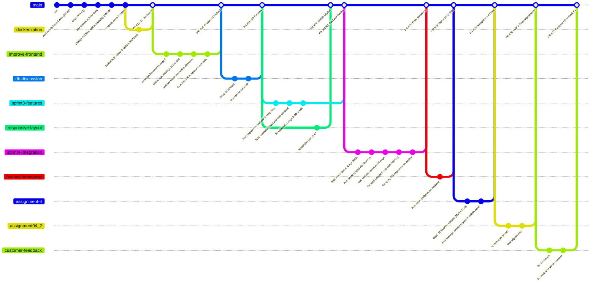

# Development Process and Configuration Management

## 1. Git Workflow Timeline

## 2. What the Timeline Shows

The diagram is a compact history of the repository’s development. It starts with the initial project setup and MVP work, then shows separate feature branches for dockerization, frontend redesign, database schema work, backend features, responsive layout, sprint 4 integration, homepage/news work, assignment documentation, user-story and UAT cleanup, and finally customer-feedback fixes.

The important pattern is that work happens on topic branches and is only brought back into `main` through pull requests. In other words, the diagram is not just a list of commits: it shows how the team uses branching to isolate work, review it, and merge it in a controlled way.

## 3. Workflow Execution & Triggers

    Isolation: No team member commits directly to main. Every feature, document rewrite, or bugfix begins by branching off main into a dedicated feature branch (e.g., sprint4-integration).

    Continuous Integration (CI): As developers push commits, automated GitHub Actions are triggered to run linting scripts (ruff / ESLint), type-checking pipelines (mypy), and the other required checks listed in the Definition of Done.

    Config & secrets: Configuration is treated as a tracked quality area, not an afterthought. The repo documents `app/config.py` as the critical module for app configuration and secrets loading, and the Definition of Done explicitly forbids committing secrets, credentials, or personal data.

    Traceability: Pull Requests are opened to merge the feature branch back into main. The PR must explicitly link to its corresponding issue or assignment milestones so the work can be traced from requirement to implementation.

    Workflow-state: The issue tracker is the source of live execution state. The current user-story index is used for stable IDs and membership, while the issue tracker keeps the current Work Status and sprint assignment. After merge, the issue Work Status is set to `Done`.

    Review & Merge: Another teammate reviews the changes, verifies the pipeline is green, and completes the merge request, deploying the code to the VPS environment.

