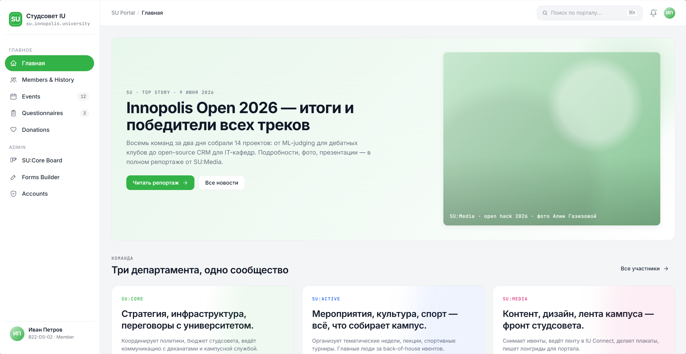
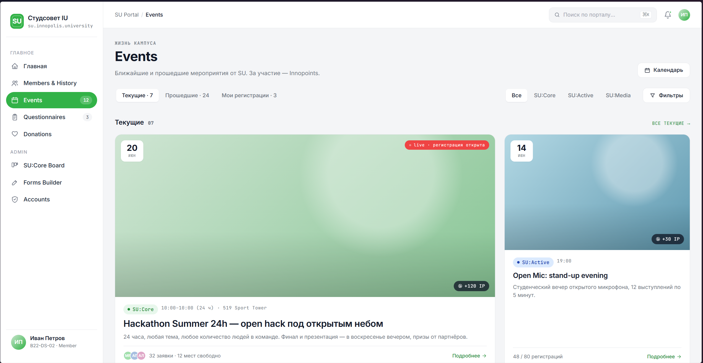
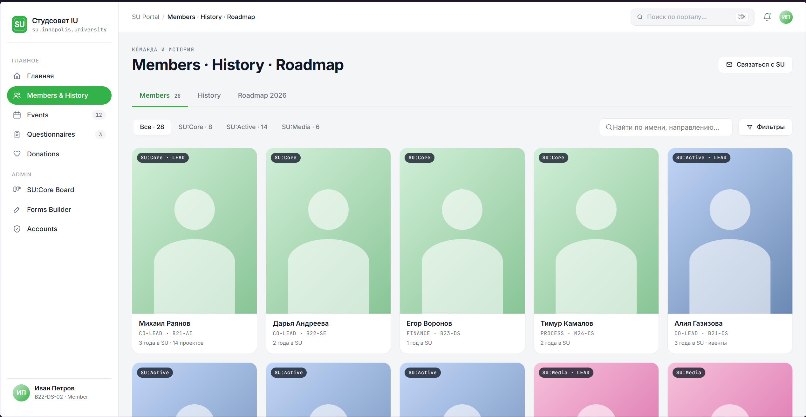
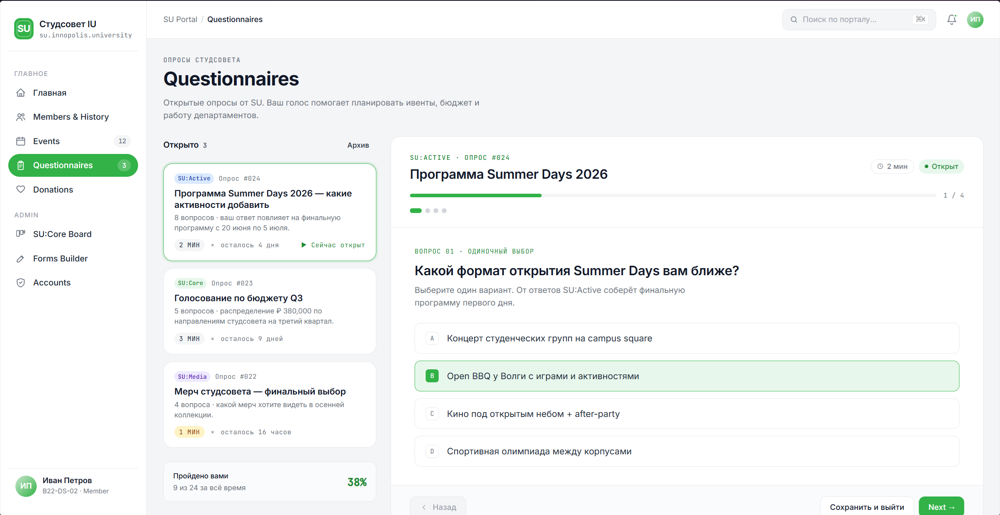
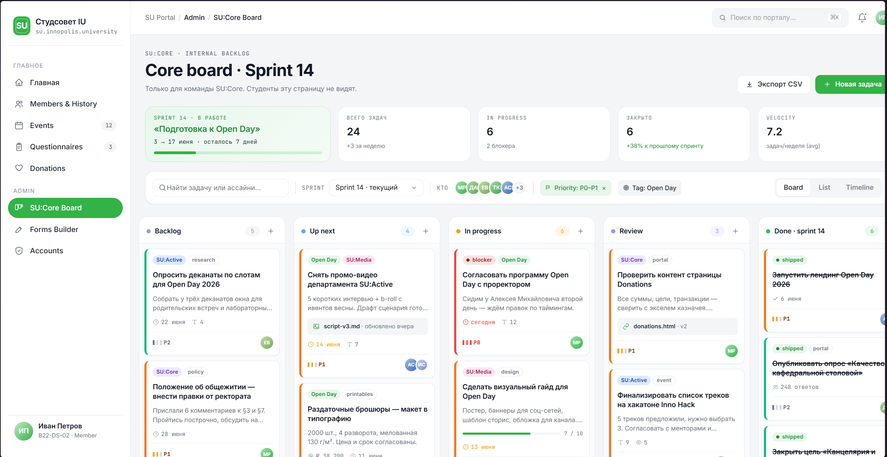
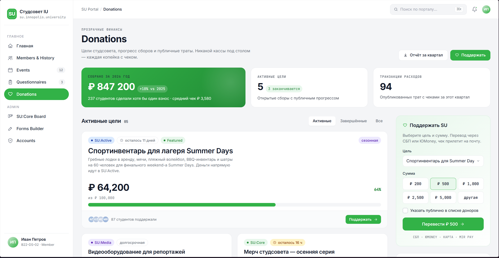
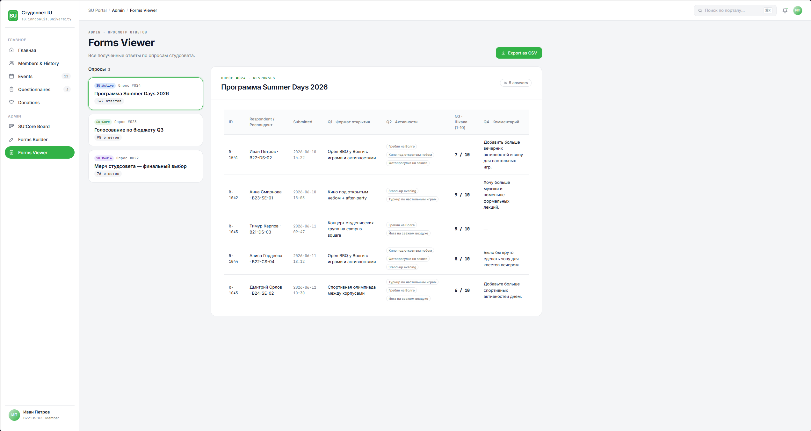
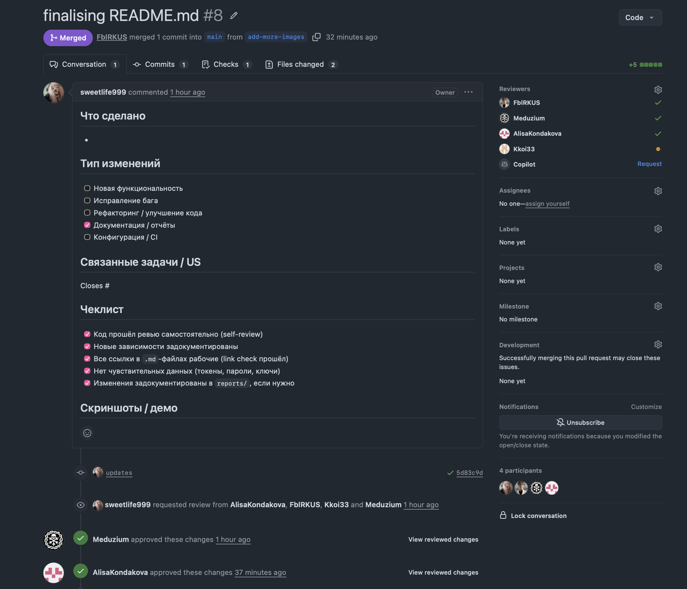
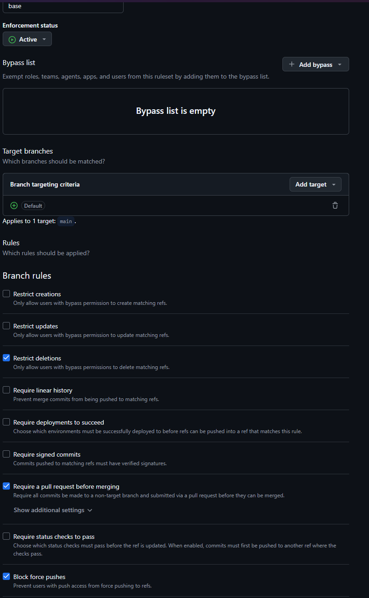

# Assignment 2 — Week 2 Report

**Project:** Student Union Portal
**Short description:** A centralised web platform connecting Innopolis University students with the Student Union — featuring public events, SU member directory, questionnaires, and an internal task tracker for SU:Core.

**License:** [MIT](../../LICENSE)

---

## 1. User Stories

[reports/week2/user-stories.md](user-stories.md)

Includes 14 active stories (US-01 – US-16, two removed), MoSCoW priorities, and the initial proposed MVP v1 scope. Updated after the Week 2 customer meeting: US-04 (donation page scope), US-07 (perspective change), US-14 (in-site result viewing added).

---

## 2. Prototype and Interface Artifacts

**Figma (view-only):** [SU Portal — Week 2 Prototype](https://www.figma.com/design/jQF7Hpaw4iLGrZM8Ei8ieT/SU-Portal-%E2%80%94-Week-2-Prototype?node-id=0-1&t=ialB7LSIfMm7k9u4-1)

| Screen | Status |
|--------|--------|
| Home (sidebar, header, hero, dept cards, news, widgets) | ✅ |
| Events (filters, event cards, mini calendar, stats) | ✅ |
| Events — Empty state | ✅ |
| Members & History (member grid, history timeline) | ✅ |
| Questionnaires (list + active survey step 1/4) | ✅ |
| Questionnaires — Success state | ✅ |
| Admin / Forms Builder (form list + editor) | ✅ |

Prototype coverage: US-01, US-05, US-08, US-11, US-12, US-13 (initial MVP v1 scope)

### Prototype screenshots

*Main page — Home screen with sidebar navigation, hero section, department cards*

*Events — upcoming events list with filters*

*Members & History — member grid and history timeline*

*Questionnaires — survey list and active survey step*

*SU:Core Board — internal task tracker*

*Donations — static info page with QR code placeholder*

*Forms viewer - page under admin panel allowing SU members to view answers on questionnaires*
---

## 3. MVP v0

**Status: deployed.** React + TypeScript + Vite SPA, 9 screens, static data.

[mvp-v0-report.md](mvp-v0-report.md) — full report, smoke-check scenario, tech stack

- **Deployment:** [https://su.fblrkus.ru](https://su.fblrkus.ru)
- **Local run:** `cd frontend && npm install && npm run dev` → <http://localhost:5173>
- **Video demo:** [Google Drive (< 2 min)](https://drive.google.com/file/d/1vD7WQghi3PnJ-NTt0Liz_f-RKZRqJ3pN/view?usp=sharing)

---

## 4. PR/MR Workflow

- PR template: [`.github/pull_request_template.md`](../../.github/pull_request_template.md) ✅
- Reviewed PRs merged during Week 2:
  - [PR #2 — Initial data and structure](https://github.com/sweetlife999/SWP/pull/2)
  - [PR #3 — MVP v0 frontend](https://github.com/sweetlife999/SWP/pull/3)
  - [PR #4 — Add week 2 screenshots](https://github.com/sweetlife999/SWP/pull/4)
  - [PR #5 — Fix markdown files and add autodeploy](https://github.com/sweetlife999/SWP/pull/5)
  - [PR #6 - cleanupSirniki(changing admin panel)](https://github.com/sweetlife999/SWP/pull/6)
  - [PR #7 - complete week 2 report: meeting docs, updated stories, analysis, translated mvp-v0-report](https://github.com/sweetlife999/SWP/pull/7)
  - [PR #8 - finalising README.md](https://github.com/sweetlife999/SWP/pull/8)
  - [PR #9 - add screenshot of branch ruleset](https://github.com/sweetlife999/SWP/pull/9)
  - [PR #10 - add links to interview and screenshot of viewed-pr](https://github.com/sweetlife999/SWP/pull/10)

### Example reviewed PR

### Protected default branch settings

---

## 5. Lychee Link Checking

- CI workflow: [`.github/workflows/link-check.yml`](../../.github/workflows/link-check.yml) ✅
- Triggers: push/PR on `*.md` files, weekly on Mondays at 07:00 UTC, manual dispatch
- Excluded links: `figma.com` (requires login), `moodle.*` (internal), `localhost`, `127.*`
- Latest runs: [GitHub Actions — Link Check](https://github.com/sweetlife999/SWP/actions/workflows/link-check.yml)

### Excluded links — manual verification

| URL pattern | Reason for exclusion | Manual status |
|-------------|---------------------|---------------|
| `figma.com` | Requires Figma account to access | Verified accessible with account ✅ |
| `moodle.*` | Internal university system | Not publicly verifiable |
| `localhost`, `127.*` | Local dev only | N/A |

---

## 6. Coverage

The following user stories are covered by the **initial proposed MVP v1 prototype**:

| Story | Title |
|-------|-------|
| US-01 | View upcoming events |
| US-05 | View SU member directory |
| US-08 | View SU departments and their info |
| US-11 | Admin publishes and manages events and news |
| US-12 | Student fills out an active questionnaire |
| US-13 | Admin creates and manages questionnaires |

The Figma prototype explores and communicates the proposed MVP v1 user experience for all six stories above.

MVP v0 is a runnable technical foundation implementing the same screens as static React components — see [mvp-v0-report.md](mvp-v0-report.md) for the full scope, smoke-check scenario, and story coverage.

---

## 7. Customer Meeting

**Meeting date:** 2026-06-12
**Status:** Held. Approvals obtained.

- **Transcript** (sanitised English, publication approved by customer): [customer-meeting-transcript.md](customer-meeting-transcript.md)
- **Supplementary notes** (handwritten notes taken during the session): [customer-meeting-notes.md](customer-meeting-notes.md)
- **Summary** (decisions, approvals, action points): [customer-meeting-summary.md](customer-meeting-summary.md)

Customer approvals received:

- ✅ User stories approved (with modifications to US-04, US-07, US-14)
- ✅ MoSCoW priorities approved
- ✅ Initial proposed MVP v1 scope approved (US-01, 05, 08, 11, 12, 13)
- ✅ Written consent to public MIT-licensed development model re-confirmed

---

## 8. Week 2 Analysis

[reports/week2/analysis.md](analysis.md)

Covers learning points from user story writing, interface design, MVP v0 deployment, and customer validation. Validated assumptions and open questions updated after the Week 2 customer meeting.

---

## 9. LLM Usage Report

[reports/week2/llm-report.md](llm-report.md)
