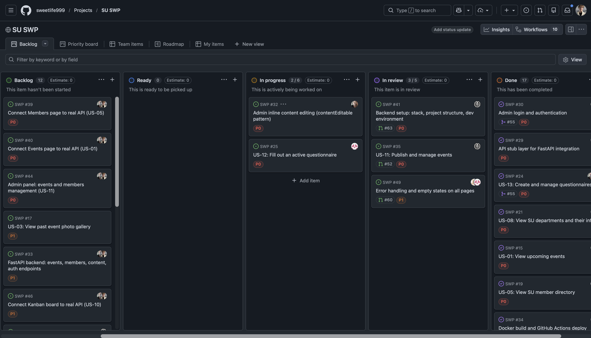
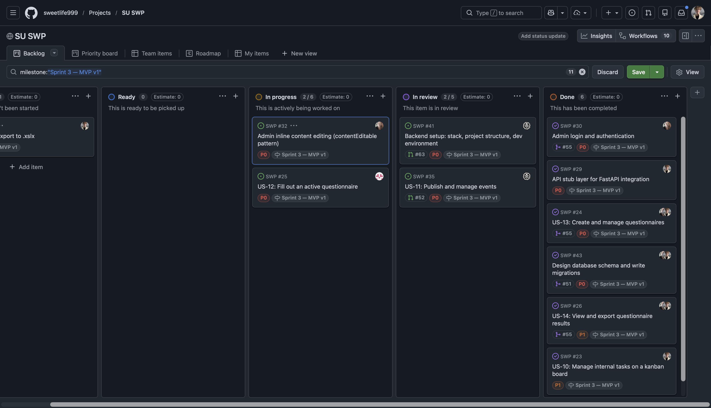
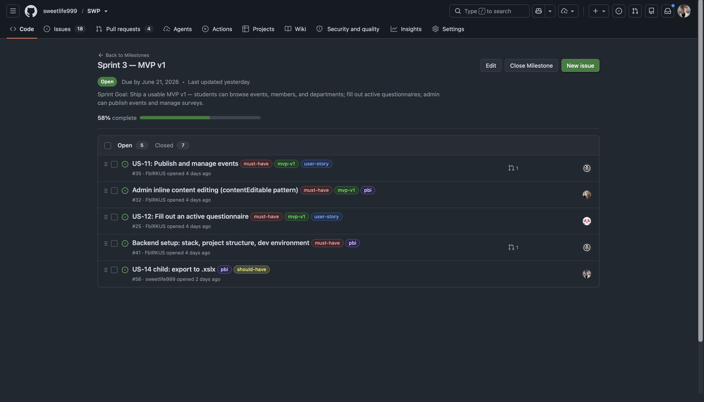
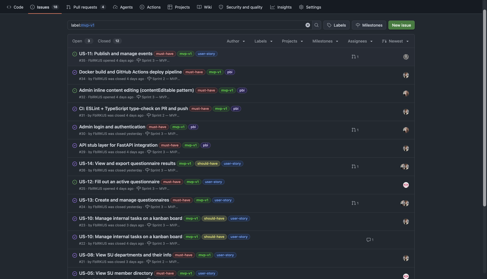
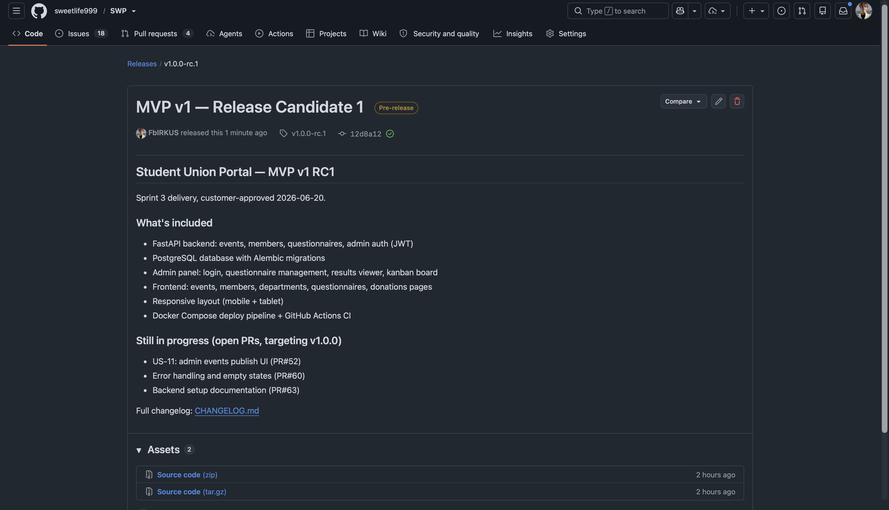
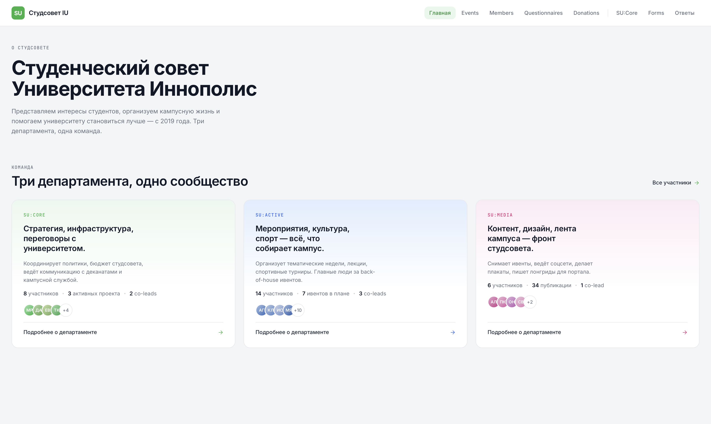

# Week 3 Report — Student Union Portal

**Project:** Student Union Portal — Innopolis University
**Team:** Team 2
**License:** [LICENSE](../../LICENSE)

---

## Quick links

| Artifact | Link |
|----------|------|
| Historical user stories (Assignment 2) | [`reports/week2/user-stories.md`](../week2/user-stories.md) |
| Current user stories index | [`docs/user-stories.md`](../../docs/user-stories.md) |
| Sprint report | [`reports/week3/sprint-report.md`](sprint-report.md) |
| Product Backlog board | [SU SWP Project](https://github.com/users/sweetlife999/projects/2) |
| Sprint Backlog board | [SU SWP Project](https://github.com/users/sweetlife999/projects/2) |
| Sprint 3 milestone | [Sprint 3 — MVP v1](https://github.com/sweetlife999/SWP/milestone/1) |
| MVP v1 filtered view | [Issues labelled mvp-v1](https://github.com/sweetlife999/SWP/issues?q=label%3Amvp-v1) |
| SemVer release (MVP v1) | [v1.0.0-rc.1](https://github.com/sweetlife999/SWP/releases/tag/v1.0.0-rc.1) |
| `CHANGELOG.md` | [`CHANGELOG.md`](../../CHANGELOG.md) |
| `docs/roadmap.md` | [`docs/roadmap.md`](../../docs/roadmap.md) |
| `docs/definition-of-done.md` | [`docs/definition-of-done.md`](../../docs/definition-of-done.md) |
| Issue templates | [`.github/ISSUE_TEMPLATE/`](../../.github/ISSUE_TEMPLATE/) |
| PR template | [`.github/pull_request_template.md`](../../.github/pull_request_template.md) |
| Delivered MVP v1 | [https://su.fblrkus.ru](https://su.fblrkus.ru) |
| Root README (access instructions) | [`README.md`](../../README.md) |

---

## Reviewed issue-linked PRs (Week 3)

- [PR#52](https://github.com/sweetlife999/SWP/pull/52) — feat: add admin events management interface (#35)
- [PR#55](https://github.com/sweetlife999/SWP/pull/55) — Backend: events, members, questionnaires, admin auth (#24, #30, #37, #42, #45)
- [PR#59](https://github.com/sweetlife999/SWP/pull/59) — Responsive layout: mobile and tablet breakpoints (#38)
- [PR#60](https://github.com/sweetlife999/SWP/pull/60) — Error handling and empty states (#49)
- [PR#61](https://github.com/sweetlife999/SWP/pull/61) — Fix backend config: cors_origins, DB credentials

---

## Screenshots

**Product Backlog view**

**Sprint Backlog view**

**Sprint milestone**

**MVP v1 filtered view**

**SemVer release**

**Delivered MVP v1**

**Example reviewed PR**

---

## Customer review

- Customer review summary: [`reports/week3/customer-review-summary.md`](customer-review-summary.md)
- Customer review transcript: [`reports/week3/customer-review-transcript.md`](customer-review-transcript.md)

---

## Other reports

- Reflection: [`reports/week3/reflection.md`](reflection.md)
- Retrospective: [`reports/week3/retrospective.md`](retrospective.md)
- LLM report: [`reports/week3/llm-report.md`](llm-report.md)
