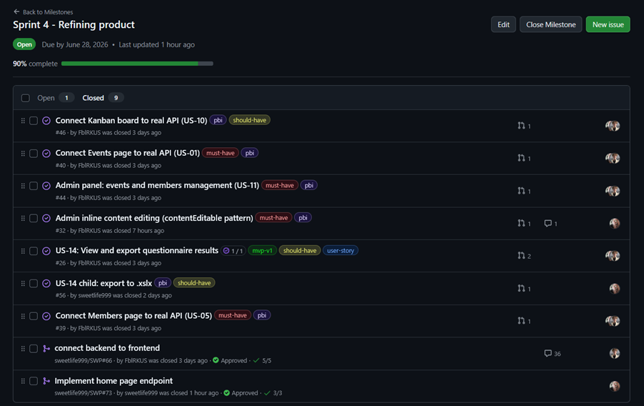
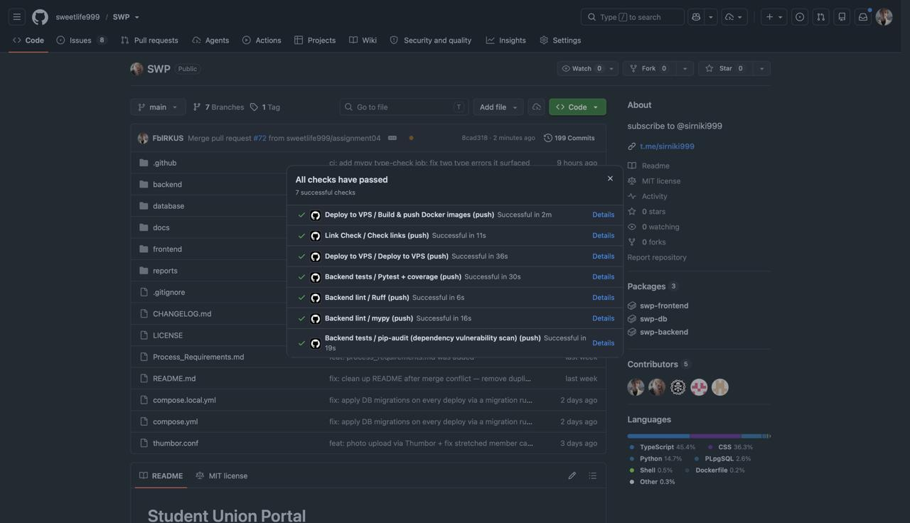
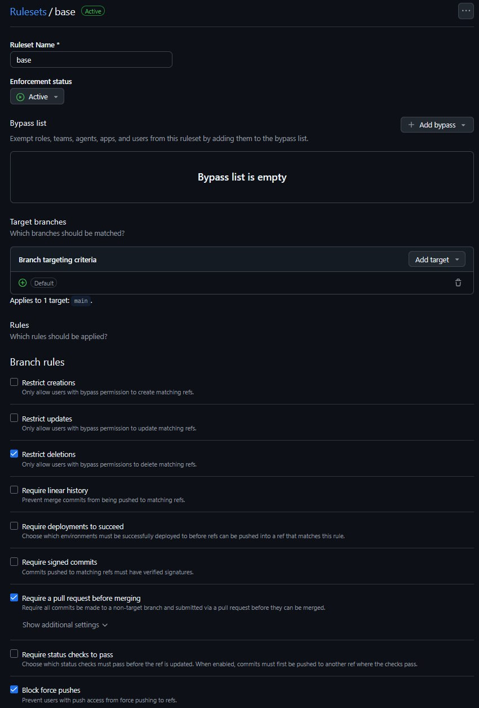
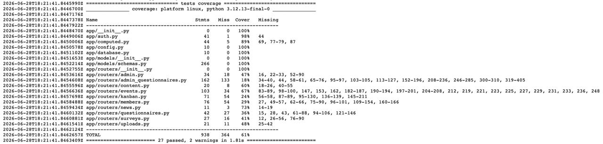
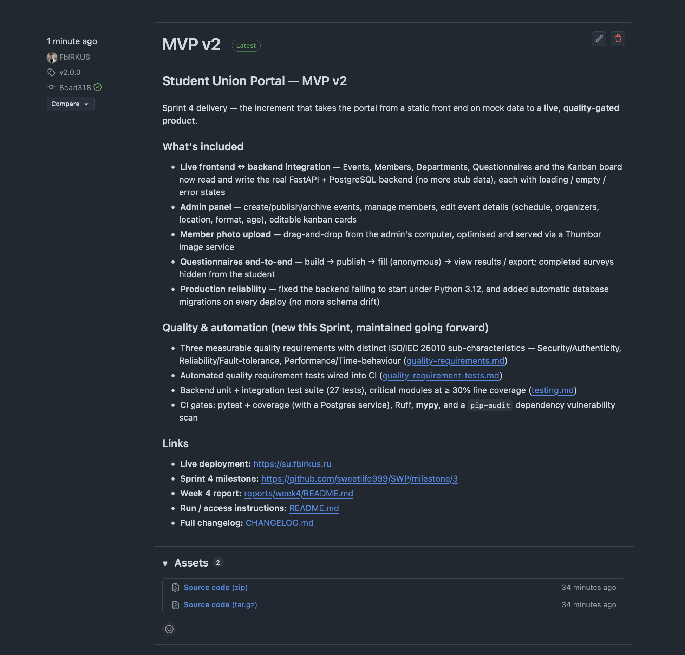
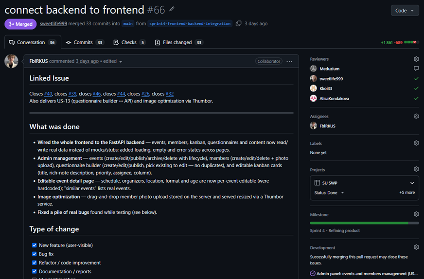

# Week 4 Report — Student Union Portal

**Project:** Student Union Portal — Innopolis University
**Team:** Team 2
**License:** [LICENSE](../../LICENSE)

> Placeholders marked `_TODO_` depend on actions outside the repository (the
> recorded customer session, the SemVer release/tag, CI-run permalinks, branch
> protection and screenshot capture). Fill them before submission. Private links
> (recordings, credentials) go to the Moodle PDF only — never to this public repo.

---

## Quick links

| Artifact | Link |
|----------|------|
| Project name & description | [Student Union Portal](#1-project) |
| Product Backlog board | [SU SWP Project](https://github.com/users/sweetlife999/projects/2) |
| Sprint Backlog board / table | [SU SWP Project](https://github.com/users/sweetlife999/projects/2) |
| Sprint 4 milestone | [Sprint 4 - Refining product](https://github.com/sweetlife999/SWP/milestone/3) |
| Deployed product | [https://su.fblrkus.ru](https://su.fblrkus.ru) |
| Run / access instructions | [root `README.md`](../../README.md) |
| `docs/roadmap.md` | [`docs/roadmap.md`](../../docs/roadmap.md) |
| `docs/definition-of-done.md` | [`docs/definition-of-done.md`](../../docs/definition-of-done.md) |
| `docs/quality-requirements.md` | [`docs/quality-requirements.md`](../../docs/quality-requirements.md) |
| `docs/quality-requirement-tests.md` | [`docs/quality-requirement-tests.md`](../../docs/quality-requirement-tests.md) |
| `docs/testing.md` | [`docs/testing.md`](../../docs/testing.md) |
| `docs/user-acceptance-tests.md` | [`docs/user-acceptance-tests.md`](../../docs/user-acceptance-tests.md) |
| `CHANGELOG.md` | [`CHANGELOG.md`](../../CHANGELOG.md) |
| CI: backend tests + coverage | [`backend-tests.yml`](../../.github/workflows/backend-tests.yml) |
| CI: backend lint | [`backend-lint.yml`](../../.github/workflows/backend-lint.yml) |
| CI: frontend lint | [`frontend-lint.yml`](../../.github/workflows/frontend-lint.yml) |
| SemVer release | _TODO_ link to `v0.2.0` (or chosen tag) release |
| Public demo video (<2 min) | [Google Drive](https://drive.google.com/file/d/15ZJ8iA8VXKoJQ-fgKp29V69HoL4ikL0h/view?usp=sharing) |
| Customer review summary | [`customer-review-summary.md`](customer-review-summary.md) |
| Reflection | [`reflection.md`](reflection.md) |
| Retrospective | [`retrospective.md`](retrospective.md) |
| LLM report | [`llm-report.md`](llm-report.md) |

---

## 1. Project

The **Student Union Portal** is an informational web portal for the Innopolis
University Student Union: students browse events, the team directory, departments,
and donation info, and fill out questionnaires; admins publish events, manage
members and surveys, and run a kanban board. React + Vite frontend, FastAPI +
PostgreSQL backend, deployed via Docker on a VPS.

## 2–4. Sprint planning

- **Product Backlog board:** [SU SWP Project](https://github.com/users/sweetlife999/projects/2)
- **Sprint Backlog board/table:** [SU SWP Project](https://github.com/users/sweetlife999/projects/2) (GitHub Projects — not a Markdown table)
- **Sprint 4 milestone:** [Sprint 4 - Refining product](https://github.com/sweetlife999/SWP/milestone/3)

## 5–6. Sprint Goal, dates, scope, size

- **Sprint Goal:** make the increment reliable and verifiable — connect the frontend
  to the live FastAPI backend, respond to customer feedback, and enforce measurable
  quality gates (automated tests, QRTs, coverage, dependency audit) in CI.
- **Sprint dates:** 2026-06-22 – 2026-06-28
- **Scope summary:** frontend↔backend integration (events, members, kanban, admin,
  questionnaires), production reliability (Python 3.12 startup fix, automatic
  migrations), and the Assignment 4 quality/automation work.
- **Total Sprint size (Story Points):** 101.

## 7. Delivered product changes

See [`CHANGELOG.md` → `[Unreleased]`](../../CHANGELOG.md). Highlights:

- Events, Members, Kanban, and Questionnaires now use the **live backend** (no more
  stub data), with loading/empty/error states.
- Admin panel: events & members management; fixed admin endpoints that previously
  failed silently.
- Member **photo upload** (drag-and-drop) optimised via a Thumbor service.
- Editable event detail (schedule, organizers, location, format, age); editable
  kanban cards.
- Questionnaires: build → publish → fill (anonymous) → view results / export;
  completed surveys hidden from the student.
- **Production restored** (backend failed to start under Python 3.12) and
  **automatic database migrations on deploy**.

## 8–9. Access

- **Deployed product:** [https://su.fblrkus.ru](https://su.fblrkus.ru)
- **Run / access instructions:** [root `README.md`](../../README.md)

## 10. Customer feedback response

| Feedback point | Resulting PBI / issue | Status | Response |
|---|---|---|---|
| Connect the backend API to the frontend (site was showing mock data) | [#40](https://github.com/sweetlife999/SWP/issues/40), [#39](https://github.com/sweetlife999/SWP/issues/39), [#44](https://github.com/sweetlife999/SWP/issues/44) | Done | Events, members, and admin panel now use the live API. |
| Merge the open MVP PRs (event publishing, questionnaire filling, inline editing) | US-11 / US-13 work | Done | Merged and wired to the backend. |
| Kanban board ("plan maximum") | [#46](https://github.com/sweetlife999/SWP/issues/46) | Done | Full board: create/move/edit cards, persisted to the backend. |
| Review the single-admin JWT model with the customer | — | Carried to Sprint Review | Discussed in the Sprint 4 review; role-based access deferred unless requested. |
| Provide real site content (members, SU history, events, donate link) | — | Customer action — pending | Content request shared; awaiting customer-provided material. |
| Production site was unreachable | fix in `2eb176b` + migration runner | Done | Root-caused (Python 3.12 startup) and fixed; migrations now apply automatically on deploy. |

## 11. Feedback not addressed

- **Role-based admin accounts:** not in scope this Sprint — the single-admin model is
  sufficient for current use; revisit if the customer requests multiple roles.
- **Real content population:** blocked on customer-provided material; the product
  supports it, the data is pending.

## 12–17. Maintained quality docs

- [`docs/roadmap.md`](../../docs/roadmap.md)
- [`docs/definition-of-done.md`](../../docs/definition-of-done.md)
- [`docs/quality-requirements.md`](../../docs/quality-requirements.md)
- [`docs/quality-requirement-tests.md`](../../docs/quality-requirement-tests.md)
- [`docs/testing.md`](../../docs/testing.md)
- [`docs/user-acceptance-tests.md`](../../docs/user-acceptance-tests.md)

## 18. Quality model & ISO/IEC 25010 sub-characteristics

Three quality requirements, each a **distinct** ISO/IEC 25010 sub-characteristic:

| QR | Characteristic | Sub-characteristic | Measure |
|----|----------------|--------------------|---------|
| QR-SEC | Security | Authenticity | 100% of admin writes without a valid token → 401; login rate-limited |
| QR-REL | Reliability | Fault tolerance | 100% of constraint-violating inputs → 422; 0 corrupt the DB / crash the API |
| QR-PERF | Performance Efficiency | Time behaviour | median `GET /events` < 500 ms |

## 19. Testing status & coverage

Backend: pytest unit + integration; **27 tests passing**. Critical-module line
coverage (all ≥ 30%):

| Critical module | Coverage |
|---|---:|
| `app/auth.py` | 98% |
| `app/models/schemas.py` | 100% |
| `app/computed.py` | 89% |
| `app/config.py` | 100% |
| `app/routers/events.py` | 67% |

Global repository coverage ~56% (lower by design — see [`docs/testing.md`](../../docs/testing.md)).

## 20–22. Test links

- **Unit tests:** [`backend/tests/test_auth.py`](../../backend/tests/test_auth.py),
  [`test_schemas.py`](../../backend/tests/test_schemas.py),
  [`test_computed.py`](../../backend/tests/test_computed.py),
  [`test_config.py`](../../backend/tests/test_config.py)
- **Integration tests:** [`backend/tests/test_integration_api.py`](../../backend/tests/test_integration_api.py)
- **Automated QRTs:** mapped in [`docs/quality-requirement-tests.md`](../../docs/quality-requirement-tests.md)
  (QRT-SEC → `test_auth.py` + `test_integration_api.py`; QRT-REL → `test_schemas.py`;
  QRT-PERF → `test_integration_api.py`)

## 23–26. CI & quality automation

- **CI pipeline:** [`.github/workflows/`](../../.github/workflows/) — backend tests +
  coverage ([`backend-tests.yml`](../../.github/workflows/backend-tests.yml)),
  backend lint, frontend lint, link-check, deploy.
- **Additional QA check:** `pip-audit` dependency vulnerability scan (the `audit` job
  in `backend-tests.yml`) — distinct from lint/format/type/build/test/coverage/QRT/
  link-check. Rationale in [`docs/testing.md`](../../docs/testing.md#additional-qa-check-dependency-vulnerability-scan).
- **Latest protected-branch CI run:** _TODO_ permalink
- **Branch protection evidence:** _TODO_ screenshot (`images/branch-protection.png`)
- **Lint / coverage / tests / QA screenshots:** _TODO_ (`images/`)

## 27. How the gates continue to govern later work

The quality requirements, QRTs, CI checks, coverage thresholds, and the updated
[Definition of Done](../../docs/definition-of-done.md) are **maintained project
assets**. Later PBIs must keep them passing or replace them with documented
equivalent-or-stronger coverage — they may not be disabled, skipped, or treated as
one-time submission evidence.

## 28–30. Release & demo

- **SemVer release (Assignment 4 increment):** _TODO_ (e.g. `v0.2.0`, tag on `main`,
  linked to the Sprint 4 milestone, run instructions, and the demo video)
- **`CHANGELOG.md`:** [link](../../CHANGELOG.md) — move `[Unreleased]` into the dated
  release section at tag time
- **Public sanitized demo video (<2 min):** [Google Drive](https://drive.google.com/file/d/15ZJ8iA8VXKoJQ-fgKp29V69HoL4ikL0h/view?usp=sharing)

## 31. Presentation (optional public copy)

- _TODO_ optional `presentation.pdf`

## 32–34. UAT & customer review

- **Public UAT results summary:** see [`customer-review-summary.md`](customer-review-summary.md)
  (UAT results table) and [`docs/user-acceptance-tests.md`](../../docs/user-acceptance-tests.md)
  execution history. _Results to be recorded after the customer session._
- **Customer review transcript / notes:** [`customer-review-transcript.md`](customer-review-transcript.md)
  Moodle only, or provide `customer-review-notes.md` if recording was refused.
- **Customer review summary:** [`customer-review-summary.md`](customer-review-summary.md)

## 35–37. Other reports

- [`reflection.md`](reflection.md)
- [`retrospective.md`](retrospective.md)
- [`llm-report.md`](llm-report.md)

## 38–39. Product status & next steps

- **Current status:** deployed and functional; frontend integrated with the live
  backend; quality gates automated in CI; production reliable after the migration
  runner.
- **Next steps:** lift secondary-router coverage; add a frontend QA check
  (`npm audit`) and evaluate SAST; populate real customer content; revisit
  role-based admin access if requested.

## 40. Contribution traceability

| Member | GitHub | Contribution this Sprint |
|--------|--------|--------------------------|
| Dmitrii Malofeev | @FblRKUS | Frontend↔backend integration ([#40](https://github.com/sweetlife999/SWP/issues/40), [#39](https://github.com/sweetlife999/SWP/issues/39), [#46](https://github.com/sweetlife999/SWP/issues/46), [#44](https://github.com/sweetlife999/SWP/issues/44), [#26](https://github.com/sweetlife999/SWP/issues/26)) via [PR#66](https://github.com/sweetlife999/SWP/pull/66)/[#68](https://github.com/sweetlife999/SWP/pull/68); production incident fix + migration runner ([PR#69](https://github.com/sweetlife999/SWP/pull/69)); quality requirements, QRTs, backend test suite, CI tests + coverage + mypy + `pip-audit`; Week 4 docs/reports ([PR#72](https://github.com/sweetlife999/SWP/pull/72)); reviewed [#71](https://github.com/sweetlife999/SWP/pull/71), [#73](https://github.com/sweetlife999/SWP/pull/73) |
| Iaroslav Moskvin (Team Lead) | @sweetlife999 | Home-page endpoint ([PR#73](https://github.com/sweetlife999/SWP/pull/73)), error/skeleton states everywhere ([PR#71](https://github.com/sweetlife999/SWP/pull/71)), XLSX export ([#56](https://github.com/sweetlife999/SWP/issues/56)/[PR#65](https://github.com/sweetlife999/SWP/pull/65)), inline content editing ([#32](https://github.com/sweetlife999/SWP/issues/32)), CORS startup fix ([PR#67](https://github.com/sweetlife999/SWP/pull/67)); co-implementer on the integration issues; backlog/milestone/board management; reviewed [#66](https://github.com/sweetlife999/SWP/pull/66), [#68](https://github.com/sweetlife999/SWP/pull/68), [#69](https://github.com/sweetlife999/SWP/pull/69), [#72](https://github.com/sweetlife999/SWP/pull/72) |
| Zakhar Gurtovoi | @Meduzium | Admin events management interface ([PR#52](https://github.com/sweetlife999/SWP/pull/52)), Process Requirements documentation ([PR#64](https://github.com/sweetlife999/SWP/pull/64)), backend work; reviewed [#66](https://github.com/sweetlife999/SWP/pull/66) |
| Olga Frolovskaia | @Kkoi33 | Responsive layout — mobile/tablet breakpoints ([#38](https://github.com/sweetlife999/SWP/issues/38)/[PR#59](https://github.com/sweetlife999/SWP/pull/59)) carried into the increment; reviewed [#66](https://github.com/sweetlife999/SWP/pull/66) |
| Alisa Kondakova | @AlisaKondakova | Error banners & empty states ([#49](https://github.com/sweetlife999/SWP/issues/49)/[PR#60](https://github.com/sweetlife999/SWP/pull/60)); reviewed [#66](https://github.com/sweetlife999/SWP/pull/66) |

> Contribution rows are derived from issues, PRs, and review activity; confirm with the team before submission.

## 41–42. Screenshots

Place in [`images/`](images/) and embed before submission:

- [x] Sprint 4 milestone — `images/sprint_milestone.png`

- [x] Latest protected-branch CI run — `images/ci_run.png`

- [x] Branch protection / rules — `images/branch-protection.png`

- [x] Coverage / test report — `images/coverage.png`

- [x] Additional QA check (`pip-audit`) result — `images/pip_audit.png`

- [x] SemVer release — `images/release.png`

- [x] Example reviewed issue-linked PR — `images/reviewed_pr.png`

