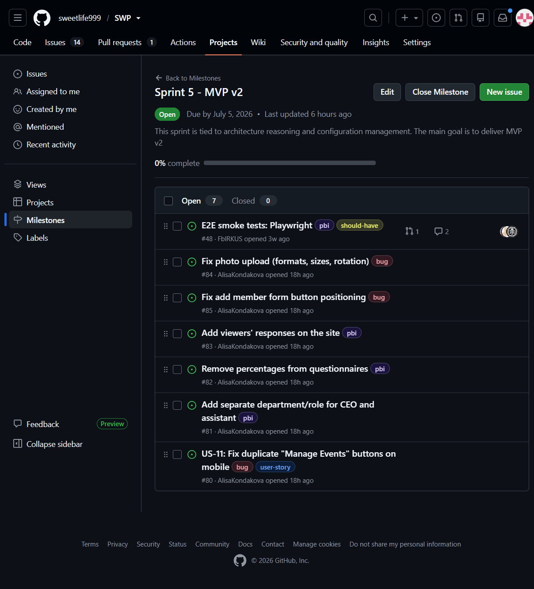
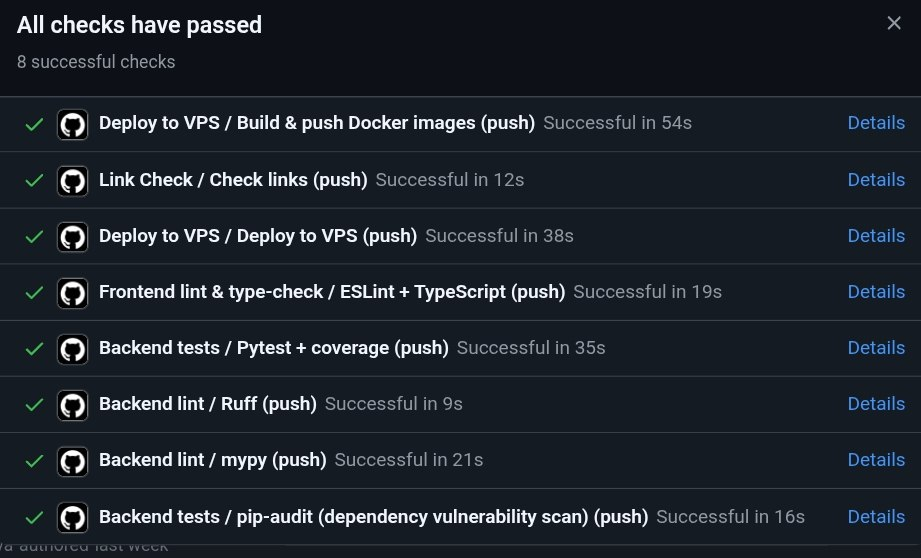
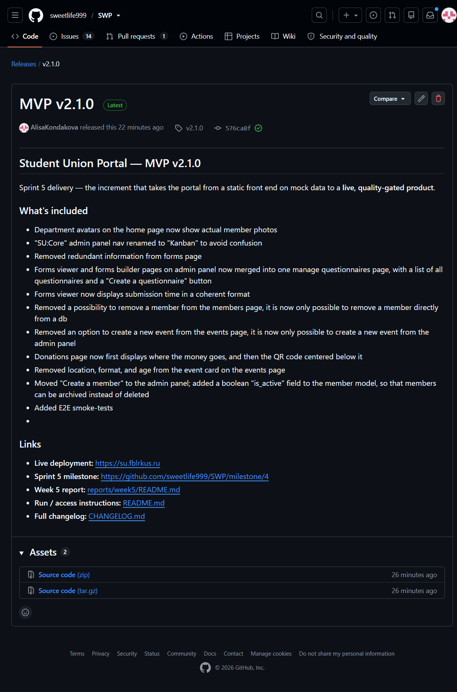
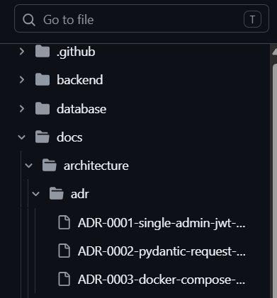

# Week 5 Report — Student Union Portal (MVP v2)

**Project:** Student Union Portal — Innopolis University
**Team:** Team 2
**License:** [LICENSE](../../LICENSE)

---

## Quick links

| Artifact | Link |
|----------|------|
| Project name & description | [Student Union Portal](#1-project) |
| Product Backlog board | [SU SWP Project](https://github.com/users/sweetlife999/projects/2) |
| Sprint Backlog board / table | [SU SWP Project](https://github.com/users/sweetlife999/projects/2) |
| Sprint 5 milestone | [Sprint 5](https://github.com/sweetlife999/SWP/milestone/4) |
| Deployed product | [https://su.fblrkus.ru](https://su.fblrkus.ru) |
| Run / access instructions | [root `README.md`](../../README.md) |
| Hosted documentation site | [GitHub Pages](https://sweetlife999.github.io/SWP/) |
| `docs/roadmap.md` | [`docs/roadmap.md`](../../docs/roadmap.md) |
| `docs/definition-of-done.md` | [`docs/definition-of-done.md`](../../docs/definition-of-done.md) |
| `docs/quality-requirements.md` | [`docs/quality-requirements.md`](../../docs/quality-requirements.md) |
| `docs/quality-requirement-tests.md` | [`docs/quality-requirement-tests.md`](../../docs/quality-requirement-tests.md) |
| `docs/testing.md` | [`docs/testing.md`](../../docs/testing.md) |
| `docs/user-acceptance-tests.md` | [`docs/user-acceptance-tests.md`](../../docs/user-acceptance-tests.md) |
| `docs/development-process.md` | [`docs/development-process.md`](../../docs/development-process.md) |
| `docs/architecture/README.md` | [`docs/architecture/README.md`](../../docs/architecture/README.md) |
| `CHANGELOG.md` | [`CHANGELOG.md`](../../CHANGELOG.md) |
| CI: backend tests + coverage | [`backend-tests.yml`](../../.github/workflows/backend-tests.yml) |
| CI: backend lint | [`backend-lint.yml`](../../.github/workflows/backend-lint.yml) |
| CI: frontend lint | [`frontend-lint.yml`](../../.github/workflows/frontend-lint.yml) |
| SemVer release (MVP v2) | [`v2.1.0`](https://github.com/sweetlife999/SWP/releases/tag/v2.1.0) |
| Public demo video (<2 min) | [Google Drive](https://drive.google.com/file/d/16xm0VSj6ILjdjnrxDuQ2PC5oVpOenGVU/view?usp=sharing) |
| Sprint review summary | [`sprint-review-summary.md`](sprint-review-summary.md) |
| Reflection | [`reflection.md`](reflection.md) |
| Retrospective | [`retrospective.md`](retrospective.md) |
| LLM report | [`llm-report.md`](llm-report.md) |

---

## 1. Project

The **Student Union Portal** is an informational web portal for the Innopolis University Student Union: students browse events, the team directory, departments, and donation info, and fill out questionnaires; admins publish events, manage members and surveys, and run a kanban board. React + Vite frontend, FastAPI + PostgreSQL backend, deployed via Docker on a VPS.

---

## 2–4. Sprint planning

- **Product Backlog board:** [SU SWP Project](https://github.com/users/sweetlife999/projects/2)
- **Sprint Backlog board/table:** [SU SWP Project](https://github.com/users/sweetlife999/projects/2) (GitHub Projects — not a Markdown table)
- **Sprint 5 milestone:** [Sprint 5](https://github.com/sweetlife999/SWP/milestone/4)

---

## 5–6. Sprint Goal, dates, scope, size

- **Sprint Goal:** Deliver MVP v2 with architectural documentation, development process formalisation, ADRs, hosted docs, and selected customer feedback from Sprint 4.
- **Sprint dates:** 2026-06-29 – 2026-07-05
- **Scope summary:** architecture documentation (Static, Dynamic, Deployment views), 3 ADRs, development process with gitGraph, hosted documentation site, customer feedback implementation from Sprint 4, product fixes.
- **Total Sprint size (Story Points):** 20

---

## 7. Delivered product changes  

See [`CHANGELOG.md` → `[v2.1.0]`](../../CHANGELOG.md). Highlights:

- **Product fixes:** redirect to `/admin/login` on token expiration (#79), navlink to admin member page (#77), lint fixes
- **Customer feedback implemented (Sprint 4):** edit on Members page, main page banner, last 4 events, removed age/format/location from events, merged admin tabs, enlarged QR code
- **Architecture documentation:** Static View (Component Diagram), Dynamic View (Sequence Diagram), Deployment View
- **3 ADRs:** React, FastAPI, PostgreSQL
- **Development Process:** `docs/development-process.md` with Mermaid gitGraph
- **Hosted Documentation:** GitHub Pages site with all `docs/` files

---

## 8–9. Access

- **Deployed product:** [https://su.fblrkus.ru](https://su.fblrkus.ru)
- **Run / access instructions:** [root `README.md`](../../README.md)

---

## 10. Customer feedback response

| Feedback point (from Sprint 4) | Resulting PBI / Issue | Status | Response |
|---|---|---|---|
| Replace delete with edit on Members page | — | Done | Added edit functionality and status/role field |
| Add banner/description on main page | — | Done | Added to main page |
| Show last 4 events in updates section | — | Done | Implemented on main page |
| Remove age/format/location fields from events | — | Done | Removed; age defaults to 0+ |
| Rename/merge admin tabs (Forms + Responses) | — | Done | Merged into "Manage Questionnaires" |
| Enlarge and center QR code on Donations page | — | Done | Fixed |

### Feedback from this Sprint (Sprint 5)

| Feedback point | Resulting PBI / Issue | Status | Response |
|---|---|---|---|
| Duplicate "Manage Events" buttons on mobile | — | Planned | Fix in Sprint 6 |
| No dedicated department for SEO and assistant | — | Planned | Add new department/role in Sprint 6 |
| Percentages on questionnaires are confusing | — | Planned | Remove in Sprint 6 |
| Submitted responses not visible on the site | — | Planned | Add responses viewer in Sprint 6 |
| Photo upload: only JPG and specific sizes; photos rotate | — | Planned | Fix in Sprint 6 |
| Add member form: submit button positioned too low | — | Planned | Fix in Sprint 6 |

---

## 11. Feedback not addressed

- All feedback from Sprint 4 was addressed.
- New feedback from Sprint 5 is planned for Sprint 6.

---

## 12–18. Maintained quality & architecture docs

- [`docs/roadmap.md`](../../docs/roadmap.md)
- [`docs/definition-of-done.md`](../../docs/definition-of-done.md)
- [`docs/quality-requirements.md`](../../docs/quality-requirements.md)
- [`docs/quality-requirement-tests.md`](../../docs/quality-requirement-tests.md)
- [`docs/testing.md`](../../docs/testing.md)
- [`docs/user-acceptance-tests.md`](../../docs/user-acceptance-tests.md)
- [`docs/development-process.md`](../../docs/development-process.md)
- [`docs/architecture/README.md`](../../docs/architecture/README.md)

---

## 19. Architecture summary

The architecture is documented with three views:

| View | Artifact | Description |
|---|---|---|
| **Static View** | [`component.puml`](../../docs/architecture/static-view/component.puml) | Component Diagram showing internal components, external systems, and communication paths |
| **Dynamic View** | [`sequence.puml`](../../docs/architecture/dynamic-view/sequence.puml) | Sequence Diagram for a non-trivial workflow (e.g., student fills a questionnaire) |
| **Deployment View** | [`deployment.puml`](../../docs/architecture/deployment-view/deployment.puml) | Deployment Diagram showing runtime services, Docker containers, and network boundaries |

The architecture supports the quality requirements (QR-SEC, QR-REL, QR-PERF) and is maintainable due to clear separation of concerns (frontend ↔ backend ↔ database).

---

## 20–22. ADRs

3 Architecture Decision Records:

| ADR | Decision | Quality Requirements |
|---|---|---|
| [ADR-001](../../docs/architecture/adr/ADR-001-react-frontend.md) | Use React + TypeScript + Vite for frontend | QR-003 (Maintainability) |
| [ADR-002](../../docs/architecture/adr/ADR-002-fastapi-backend.md) | Use FastAPI for backend | QR-PERF (Performance), QR-REL (Reliability) |
| [ADR-003](../../docs/architecture/adr/ADR-003-postgres-database.md) | Use PostgreSQL as the database | QR-REL (Reliability), QR-SEC (Authenticity) |

---

## 23. Quality model & ISO/IEC 25010 sub-characteristics

| QR | Characteristic | Sub-characteristic | Related ADR |
|---|---|---|---|
| QR-SEC | Security | Authenticity | ADR-002, ADR-003 |
| QR-REL | Reliability | Fault tolerance | ADR-002, ADR-003 |
| QR-PERF | Performance Efficiency | Time behaviour | ADR-001, ADR-002 |

---

## 24–26. Testing & coverage

- **Unit tests:** [`backend/tests/test_auth.py`](../../backend/tests/test_auth.py), [`test_schemas.py`](../../backend/tests/test_schemas.py), [`test_computed.py`](../../backend/tests/test_computed.py), [`test_config.py`](../../backend/tests/test_config.py)
- **Integration tests:** [`backend/tests/test_integration_api.py`](../../backend/tests/test_integration_api.py)
- **QRTs:** [`docs/quality-requirement-tests.md`](../../docs/quality-requirement-tests.md)
- **Coverage:** all critical modules ≥ 30% (see [`docs/testing.md`](../../docs/testing.md))

---

## 27–30. CI & quality automation

- **CI pipeline:** [`.github/workflows/`](../../.github/workflows/) — backend tests + coverage, backend lint, frontend lint, link-check, deploy
- **Additional QA check:** `pip-audit` dependency vulnerability scan
- **Latest protected-branch CI run:** [Actions → Backend tests on `main`](https://github.com/sweetlife999/SWP/actions/workflows/backend-tests.yml?query=branch%3Amain)
- **Branch protection:** enabled on `main`

---

## 31–33. Release & demo

- **SemVer release (MVP v2):** [`v2.1.0`](https://github.com/sweetlife999/SWP/releases/tag/v2.1.0)
- **`CHANGELOG.md`:** [link](../../CHANGELOG.md)
- **Public sanitized demo video (<2 min):** [Google Drive](https://drive.google.com/file/d/16xm0VSj6ILjdjnrxDuQ2PC5oVpOenGVU/view?usp=sharing)

---

## 34–36. UAT & customer review

- **UAT results summary:** see [`sprint-review-summary.md`](sprint-review-summary.md) (UAT results table)
- **Customer review notes:** [`sprint-review-notes.md`](sprint-review-notes.md) — published in the repository with the customer's permission
- **Customer review summary:** [`sprint-review-summary.md`](sprint-review-summary.md)

---

## 37–39. Other reports

- [`reflection.md`](reflection.md)
- [`retrospective.md`](retrospective.md)
- [`llm-report.md`](llm-report.md)

---

## 40–41. Product status & next steps

- **Current status:** MVP v2 deployed and functional; architecture documented; ADRs recorded; development process formalised; customer feedback from Sprint 4 addressed
- **Next steps:** Fix new feedback from Sprint 5 (duplicate buttons, SEO department, remove percentages, responses viewer, photo upload, form button); continue quality automation

---

## 42. Contribution traceability

| Member | GitHub | Contribution this Sprint |
|--------|--------|--------------------------|
| Iaroslav Moskvin | @sweetlife999 | Admin redirect fix (#79), architecture documentation, ADRs, hosted docs setup, product fixes |
| Dmitrii Malofeev | @FblRKUS | Customer feedback implementation, dev process documentation, QA |
| Zakhar Gurtovoi | @Meduzium | Backend fixes, code review, QA |
| Olga Frolovskaia | @Kkoi33 | Frontend fixes, UI/UX, responsive improvements |
| Alisa Kondakova | @AlisaKondakova | Sprint 5 reports, documentation, presentation |

---

## 43–44. TODO    Screenshots

- [x] Sprint 5 milestone — `images/sprint_milestone.png`

- [x] Board / project workflow view — `images/board_view.png`

- [x] Latest protected-branch CI run — `images/ci_run.png`

- [x] SemVer release — `images/release.png`

- [x] Example reviewed issue-linked PR — `images/reviewed_pr.png`

- [x] Hosted docs site — `images/hosted_docs.png`

- [x] Architecture diagrams — `images/architecture.png`

- [x] ADR directory — `images/adr_list.png`

