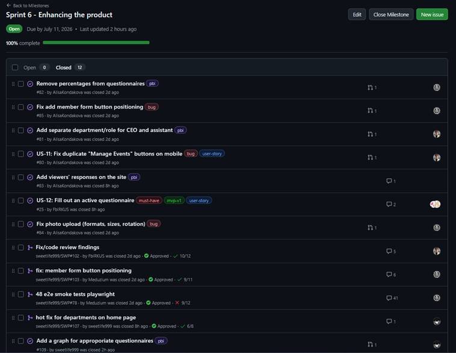
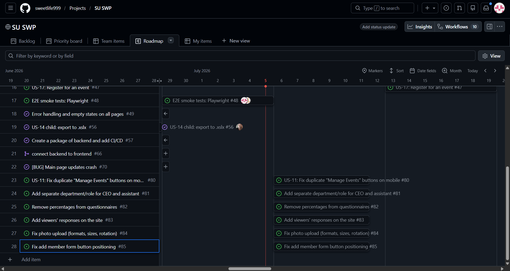
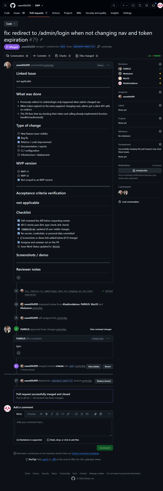

# Week 6 Report — Student Union Portal (MVP v2)

**Project:** Student Union Portal — Innopolis University
**Team:** Team 2
**License:** [LICENSE](../../LICENSE)

---

## Quick links

| Artifact | Link |
|----------|------|
| Project name & description | [Student Union Portal](#1-project) |
| Product Backlog board | [SU SWP Project](https://github.com/users/sweetlife999/projects/2) |
| Sprint Backlog board / table | [SU SWP Project](https://github.com/users/sweetlife999/projects/2) |
| Sprint 6 milestone | [Sprint 6](https://github.com/sweetlife999/SWP/milestone/5) |
| Deployed product | [https://su.fblrkus.ru](https://su.fblrkus.ru) |
| Run / access instructions | [root `README.md`](../../README.md) |
| Hosted documentation site | [GitHub Pages](https://sweetlife999.github.io/SWP/) |
| `docs/roadmap.md` | [`docs/roadmap.md`](../../docs/roadmap.md) |
| `docs/definition-of-done.md` | [`docs/definition-of-done.md`](../../docs/definition-of-done.md) |
| `docs/quality-requirements.md` | [`docs/quality-requirements.md`](../../docs/quality-requirements.md) |
| `docs/quality-requirement-tests.md` | [`docs/quality-requirement-tests.md`](../../docs/quality-requirement-tests.md) |
| `docs/testing.md` | [`docs/testing.md`](../../docs/testing.md) |
| `docs/user-acceptance-tests.md` | [`docs/user-acceptance-tests.md`](../../docs/user-acceptance-tests.md) |
| `docs/development-process.md` | [`docs/development-process.md`](../../docs/development-process.md) |
| `docs/architecture/README.md` | [`docs/architecture/README.md`](../../docs/architecture/README.md) |
| `CHANGELOG.md` | [`CHANGELOG.md`](../../CHANGELOG.md) |
| CI: backend tests + coverage | [`backend-tests.yml`](../../.github/workflows/backend-tests.yml) |
| CI: backend lint | [`backend-lint.yml`](../../.github/workflows/backend-lint.yml) |
| CI: frontend lint | [`frontend-lint.yml`](../../.github/workflows/frontend-lint.yml) |
| SemVer release (MVP v2) | [`2.2.0`](https://github.com/sweetlife999/SWP/releases/tag/v2.2.0) |
| Public demo video (<2 min) | [Google Drive](https://drive.google.com/file/d/1I4BExEOoeFm8iQPX-2A1td5rHuiTUFhE/view?usp=sharing) |
| Sprint review summary | [`sprint-review-summary.md`](sprint-review-summary.md) |
| Reflection | [`reflection.md`](reflection.md) |
| Retrospective | [`retrospective.md`](retrospective.md) |
| LLM report | [`llm-report.md`](llm-report.md) |

---

## 1. Project

The **Student Union Portal** is an informational web portal for the Innopolis University Student Union: students browse events, the team directory, departments, and donation info, and fill out questionnaires; admins publish events, manage members and surveys, and run a kanban board. React + Vite frontend, FastAPI + PostgreSQL backend, deployed via Docker on a VPS.

---

## 2–4. Sprint planning

- **Product Backlog board:** [SU SWP Project](https://github.com/users/sweetlife999/projects/2)
- **Sprint Backlog board/table:** [SU SWP Project](https://github.com/users/sweetlife999/projects/2) (GitHub Projects — not a Markdown table)
- **Sprint 6 milestone:** [Sprint 6](https://github.com/sweetlife999/SWP/milestone/5)

---

## 5–6. Sprint Goal, dates, scope, size

- **Sprint Goal:** Deliver MVP v2, fix the bugs found, remove remained mock data, polish the product in general, prepare the product for handover to customer.
- **Sprint dates:** 2026-07-06 – 2026-07-12
- **Scope summary:** Remove remained mock data, fix add member form button positioning and photo uploading (formats, sizes, rotation), add separate department/role for CEO and assistant, add graphs for questionnaires.
- **Total Sprint size (Story Points):** 86

---

## 7. Delivered product changes  

See [`CHANGELOG.md` → `[2.2.0]`](../../CHANGELOG.md).

Highlights:
- Added separate department/role for CEO and assistant
- Removed remained mock data
- Fixed bugs with add member form and photo uploading
- Added a graph for appropriate questionnaires

---

## 8–9. Access

- **Deployed product:** [https://su.fblrkus.ru](https://su.fblrkus.ru)
- **Run / access instructions:** [root `README.md`](../../README.md)

---

## 10-14. Links to the documents
**README:** [README.md](../../README.md)
**Contributing:** [CONTRIBUTING.md](../../CONTRIBUTING.md)
**AGENTS:** [AGENTS.md](../../AGENTS.md)
**Customer handover:** [docs/customer-handover.md](../../docs/customer-handover.md)
**Hosted documentation:** [Site](https://sweetlife999.github.io/SWP/)

---

## 15. Feedback from customer-facing documentation review

| Feedback point | Response |
|---|---|
| Clear definitions of quality requirements with corresponding ADRs (QR-SEC, QR-REL, QR-PERF) | — |
| Incomplete handover process details for customer transition | Clarify in Sprint 7 |
| Unclear process for handling future architecture changes | Clarify in Sprint 7 |

---

## 16. Transition-readiness summary

The transition process is mostly clear. In Week 7 we will provide more details and clarifies in sense of product transition to the customer.

---

## 17. Customer feedback response

| Feedback point (from Sprint 5) | Resulting PBI / Issue | Status | Response |
|---|---|---|---|
| Duplicate "Manage Events" buttons on mobile | — | Done | The second button was removed |
| No dedicated department for CEO and assistant | — | Done | Added new department SU:Support |
| Percentages on questionnaires are confusing | — | Done | Removed in Sprint 6 |
| Submitted responses not visible on the site | — | Done | Added responses viewer in Sprint 6 |
| Photo upload: only JPG and specific sizes; photos rotate | — | Done | Fixed in Sprint 6 |
| Add member form: submit button positioned too low | — | Done | Fixed in Sprint 6 |

### Feedback from this Sprint (Sprint 6)

| Feedback point | Resulting PBI / Issue | Status | Response |
|---|---|---|---|
| Questionnaires results should be represented as graphs | — | Planned | Make it in Sprint 7 |
| The project should have swagger | — | Done | Due to using FastAPI, swagger is already exist |

---

## 18. Feedback not addressed

- All feedback from Sprint 5 was addressed.
- New feedback from Sprint 6 is planned for Sprint 7.

---

## 19–20. Maintained quality & architecture docs

- [`docs/roadmap.md`](../../docs/roadmap.md)
- [`docs/definition-of-done.md`](../../docs/definition-of-done.md)
- [`docs/quality-requirements.md`](../../docs/quality-requirements.md)
- [`docs/quality-requirement-tests.md`](../../docs/quality-requirement-tests.md)
- [`docs/testing.md`](../../docs/testing.md)
- [`docs/user-acceptance-tests.md`](../../docs/user-acceptance-tests.md)
- [`docs/development-process.md`](../../docs/development-process.md)
- [`docs/architecture/README.md`](../../docs/architecture/README.md)

### Architecture summary

The architecture is documented with three views:

| View | Artifact | Description |
|---|---|---|
| **Static View** | [`component.puml`](../../docs/architecture/static-view/component.puml) | Component Diagram showing internal components, external systems, and communication paths |
| **Dynamic View** | [`sequence.puml`](../../docs/architecture/dynamic-view/sequence.puml) | Sequence Diagram for a non-trivial workflow (e.g., student fills a questionnaire) |
| **Deployment View** | [`deployment.puml`](../../docs/architecture/deployment-view/deployment.puml) | Deployment Diagram showing runtime services, Docker containers, and network boundaries |

The architecture supports the quality requirements (QR-SEC, QR-REL, QR-PERF) and is maintainable due to clear separation of concerns (frontend ↔ backend ↔ database).

### ADRs

3 Architecture Decision Records:

| ADR | Decision | Quality Requirements |
|---|---|---|
| [ADR-0001](../../docs/architecture/adr/ADR-0001-single-admin-jwt-authentication.md) | Single-Admin JWT Authentication for Admin Write Endpoints | QR-SEC |
| [ADR-0002](../../docs/architecture/adr/ADR-0002-pydantic-request-validation.md) | Validate All Write Requests with Pydantic Schemas at the API Boundary | QR-REL |
| [ADR-0003](../../docs/architecture/adr/ADR-0003-docker-compose-deployment-on-vps.md) | Deploy via Docker Compose on a Single VPS with GHCR-Built Images | QR-FE, QR-PERF |

### Quality model & ISO/IEC 25010 sub-characteristics

| QR | Characteristic | Sub-characteristic | Related ADR |
|---|---|---|---|
| QR-SEC | Security | Authenticity | ADR-0001, ADR-0002 |
| QR-REL | Reliability | Fault tolerance | ADR-0002, ADR-0003 |
| QR-PERF | Performance Efficiency | Time behaviour | ADR-0003 |

### Testing & coverage

- **Unit tests:** [`backend/tests/test_auth.py`](../../backend/tests/test_auth.py), [`test_schemas.py`](../../backend/tests/test_schemas.py), [`test_computed.py`](../../backend/tests/test_computed.py), [`test_config.py`](../../backend/tests/test_config.py)
- **Integration tests:** [`backend/tests/test_integration_api.py`](../../backend/tests/test_integration_api.py)
- **QRTs:** [`docs/quality-requirement-tests.md`](../../docs/quality-requirement-tests.md)
- **Coverage:** all critical modules ≥ 30% (see [`docs/testing.md`](../../docs/testing.md))

### CI & quality automation

- **CI pipeline:** [`.github/workflows/`](../../.github/workflows/) — backend tests + coverage, backend lint, frontend lint, link-check, deploy
- **Additional QA check:** `pip-audit` dependency vulnerability scan
- **Latest protected-branch CI run:** [Actions → Backend tests on `main`](https://github.com/sweetlife999/SWP/actions/workflows/backend-tests.yml?query=branch%3Amain)
- **Branch protection:** enabled on `main`

---

## 21 and 24. Summary of relevant UAT or customer-trial results

- **UAT results summary:** see [`sprint-review-summary.md`](sprint-review-summary.md) (UAT results table)
- **Customer review summary:** [`sprint-review-summary.md`](sprint-review-summary.md)
- **Sprint review transcript:** [`sprint-review-transcript.md`](sprint-review-transcript.md)

## 22-23. Release & Demo

- **SemVer release (MVP v2):** [`2.2.0`](https://github.com/sweetlife999/SWP/releases/tag/v2.2.0) — tag on `main`, mapping to Sprint 6, with links to milestone, run instructions, and demo video
- **`CHANGELOG.md`:** [link](../../CHANGELOG.md) — `[Unreleased]` moved into the dated `[2.2.0] — 2026-07-12` section
- **Public sanitized demo video (<2 min):** [Google Drive](https://drive.google.com/file/d/1I4BExEOoeFm8iQPX-2A1td5rHuiTUFhE/view?usp=sharing)

---

## 25–28. Other reports

- [`sprint-review-summary.md`](sprint-review-summary.md)
- [`reflection.md`](reflection.md)
- [`retrospective.md`](retrospective.md)
- [`llm-report.md`](llm-report.md)

---

## 29. Product status & next steps

- **Current status:** MVP v2 deployed and functional; architecture documented; ADRs recorded; development process formalised; customer feedback from Sprint 5 addressed; mock data is fully removed
- **Next steps:** Make features from customer's feedback, polish the product before final presentation and handout the product to the customer

---

## 30. Contribution traceability

| Member | GitHub | Contribution this Sprint |
|--------|--------|--------------------------|
| Iaroslav Moskvin | @sweetlife999 | Backend hotfixes, hosted docs setup |
| Dmitrii Malofeev | @FblRKUS |Deploy pipeline fixes, backend fixes |
| Zakhar Gurtovoi | @Meduzium | Frontend fixes, documentation, QA |
| Olga Frolovskaia | @Kkoi33 | Sprint 6 reports, QA |
| Alisa Kondakova | @AlisaKondakova | Documentation, presentation |

---

## 31. Screenshots

- Sprint 6 milestone — `images/sprint_milestone.png`

- Board / project workflow view — `images/board_view.png`

- Latest protected-branch CI run — `images/ci_run.png`

- SemVer release — `images/release.png` <----- TODO
- Example reviewed issue-linked PR — `images/reviewed_pr.png`

- Hosted docs site — `images/hosted_docs.png`

- Architecture diagrams — `images/architecture.png`

- ADR directory — `images/adr_list.png`
