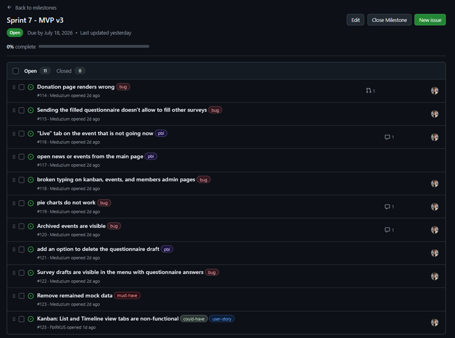
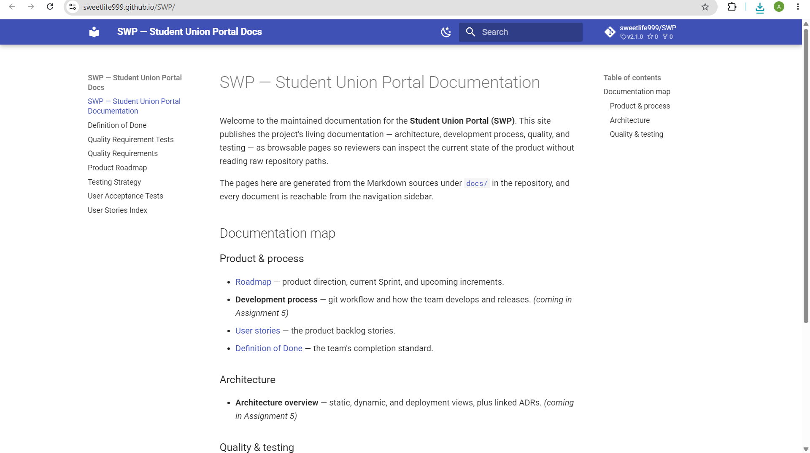
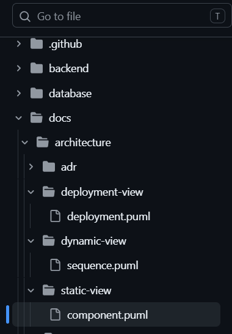

# Week 6 Report — Student Union Portal (MVP v2)

**Project:** Student Union Portal — Innopolis University
**Team:** Team 2
**License:** [LICENSE](../../LICENSE)

---

## 1-6. Sprint 7 links & main information

- **Report from week 6:** [`reports/week6/README.md`](../../reports/week6/README.md)
- **Product Backlog board:** [SU SWP Project](https://github.com/users/sweetlife999/projects/2)
- **Sprint Backlog board:** [SU SWP Project](https://github.com/users/sweetlife999/projects/2)
- **Sprint 7 milestone:** [Sprint 7](https://github.com/sweetlife999/SWP/milestone/6)

---

- **Sprint Goal:** Deliver MVP v3, fix the bugs found, remove all mock data, prepare the product for the final handover to customer.
- **Sprint dates:** 2026-07-13 – 2026-07-19
- **Scope summary:** Remove all mock data, fix "add" menus on Kanban, events, and members admin pages, fix pie charts render, archieved events visibility, fix questionnaires and donation page render. 
- **Total Sprint size (Story Points):** 17

---

## 7. Delivered product changes  

See [`CHANGELOG.md` → `[2.3.0]`](../../CHANGELOG.md).

Highlights:
- Removed all mock data
- Fixed bugs with "add" menus on admin pages (members, events, kanban)
- Fixed pie chart render for questionnaires

---

## 8–9. Access

- **Deployed product:** [https://su.fblrkus.ru](https://su.fblrkus.ru)
- **Run / access instructions:** [root `README.md`](../../README.md)

---

## 10-14. Links to the documents
**README:** [README.md](../../README.md)
**Contributing:** [CONTRIBUTING.md](../../CONTRIBUTING.md)
**AGENTS:** [AGENTS.md](../../AGENTS.md)
**Customer handover:** [docs/customer-handover.md](../../docs/customer-handover.md)
**Hosted documentation:** [Site](https://sweetlife999.github.io/SWP/)

---

## 15. Handover summary

TODO after meeting with customers

---

## 16. Transition-readiness summary

TODO after meeting with customers

`Summary of what was transferred, delegated, or otherwise made available during the final transition, with direct reference to the current docs/customer-handover.md.`

---

## 17. Transition limitations

TODO after meeting with customers

---

## 18. Customer-side summary

TODO after meeting with customers

---

## 19. Customer feedback response table

---

## 20. Summary of relevant UAT or customer-trial results

- **UAT results summary:** see [`sprint-review-summary.md`](sprint-review-summary.md) (UAT results table)

---

## 21-23. Maintained quality & architecture docs

TODO: MAKE A 2.3.0 RELEASE
- **SemVer release (MVP v3):** [`2.3.0`](https://github.com/sweetlife999/SWP/releases/tag/v2.3.0) — tag on `main`, mapping to Sprint 7, with links to milestone, run instructions, and demo video
- **`CHANGELOG.md`:** [link](../../CHANGELOG.md) — `[Unreleased]` moved into the dated `[2.3.0] — 2026-07-19` section
- **Public sanitized demo video (<2 min):** [Google Drive](TODO)

---

## 24. Demo day preparation summary

TODO

---

## 25. Sprint review & transcript

- **Customer review summary:** [`sprint-review-summary.md`](sprint-review-summary.md)
- **Sprint review transcript:** [`sprint-review-transcript.md`](sprint-review-transcript.md)

---

## 26–29. Other reports

- [`sprint-review-summary.md`](sprint-review-summary.md)
- [`reflection.md`](reflection.md)
- [`retrospective.md`](retrospective.md)
- [`llm-report.md`](llm-report.md)

---

## 30. Summary of the final product status

- **Final status:** MVP v3 is deployed and functional, architecture is documented, ADRs are recorded, development process is formalised. The product is fully functional and ready to use in production. All requirements were satisfied and optional features were added (e.g. Kanban board for internal tasks).

---

## 31. Contribution traceability

| Member | GitHub | Contribution this Sprint |
|--------|--------|--------------------------|
| Iaroslav Moskvin | @sweetlife999 | Backend fixes, product fixes, QA |
| Dmitrii Malofeev | @FblRKUS | Backend fixes, PR reviews, QA |
| Zakhar Gurtovoi | @Meduzium | Frontend fixes, documentation |
| Olga Frolovskaia | @Kkoi33 | Demo day presentation, documentation |
| Alisa Kondakova | @AlisaKondakova | Demo day presentation, Sprint 7 reports |

---

## 32. Screenshots

- Sprint 7 milestone — `images/sprint_milestone.png`
 TODO
- Board / project workflow view — `images/board_view.png`

- Latest protected-branch CI run — `images/ci_run.png`

- SemVer release — TODO
- Example reviewed issue-linked PR — `images/reviewed_pr.png`

- Hosted docs site — `images/hosted_docs.png`

- Architecture diagrams — `images/architecture.png`

- ADR directory — `images/adr_list.png`
